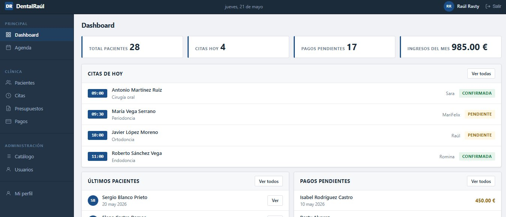
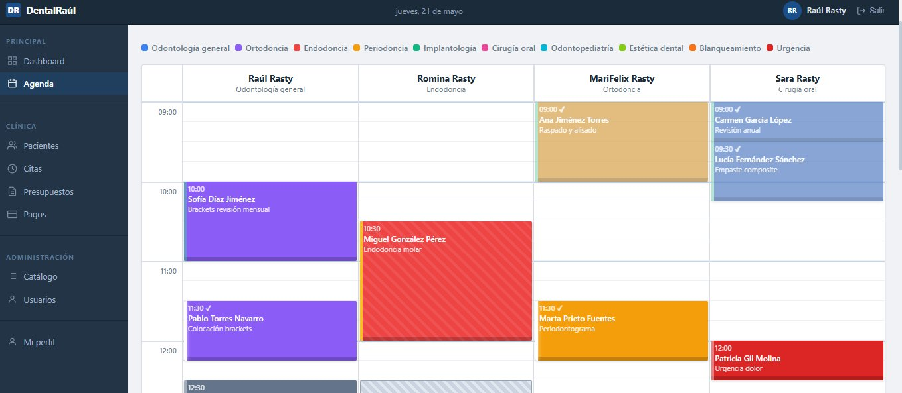
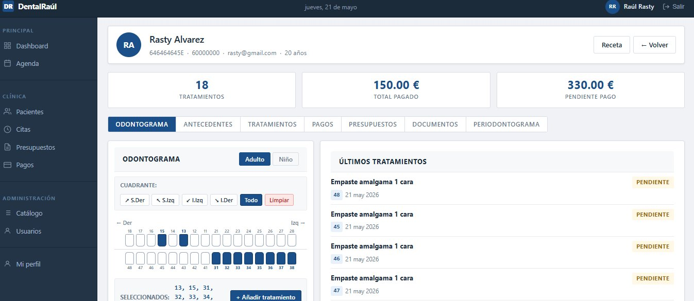
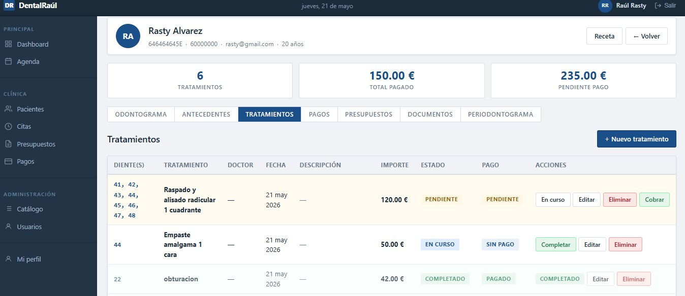
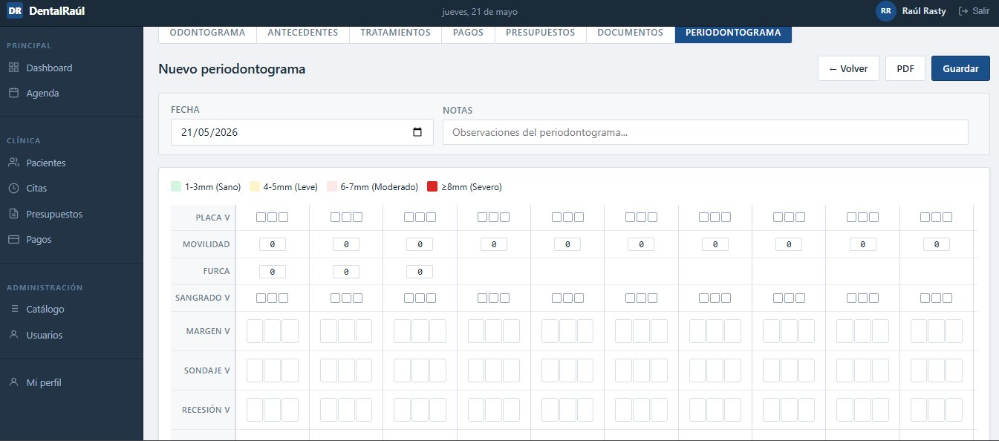
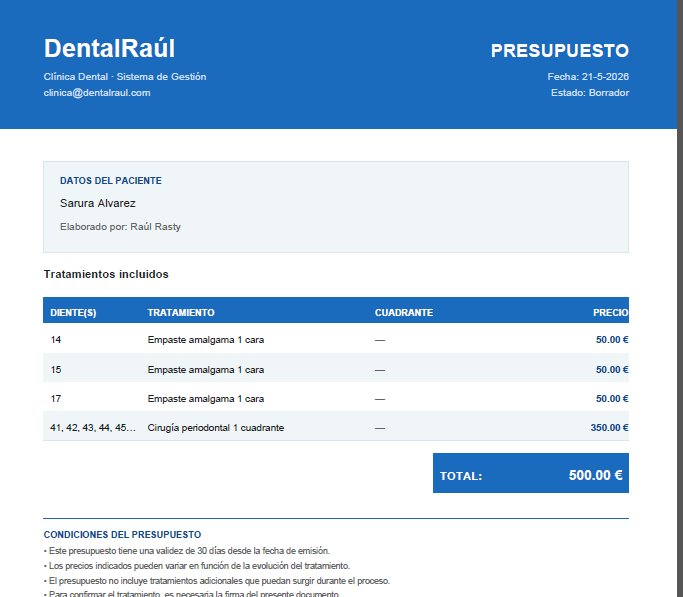

# DentalRaúl — Sistema de Gestión Clínica Dental

Aplicación web completa para la gestión de clínicas dentales. Desarrollada con Node.js, Express y Supabase como proyecto de portfolio.



---

## Capturas de pantalla

### Agenda visual con drag & drop


### Ficha de paciente con odontograma interactivo


### Gestión de tratamientos


### Periodontograma clínico


### Presupuesto exportado a PDF


---

## Características principales

- **Agenda visual** — Vista semanal y diaria por doctor con drag & drop, redimensionado de citas y menú contextual
- **Gestión de pacientes** — Ficha completa con odontograma interactivo, historial clínico, antecedentes y documentos
- **Tratamientos** — Control de estado (pendiente / en curso / completado), buscador de catálogo integrado, modo individual por diente o global por cuadrante
- **Presupuestos** — Creación con mini odontograma, modos de precio individual/global, exportación a PDF profesional
- **Pagos** — Registro de cobros, estadísticas de ingresos mensuales y pendientes
- **Periodontograma** — Registro clínico completo con sondaje, sangrado, placa y movilidad; comparación entre exploraciones con gráfica
- **Documentos** — Subida de archivos por tipo con filtrado
- **Receta médica** — Generación de recetas en PDF formato A5
- **Catálogo de tratamientos** — Gestión de precios por categoría
- **Usuarios y roles** — Admin, doctor, recepcionista e invitado (solo lectura)

---

## Stack tecnológico

| Capa | Tecnología |
|------|-----------|
| Backend | Node.js + Express |
| Base de datos | Supabase (PostgreSQL) |
| Autenticación | Supabase Auth + cookies HTTP-only |
| Frontend | HTML + CSS + JavaScript vanilla |
| PDF | jsPDF |
| Gráficas | Chart.js |
| Almacenamiento | Supabase Storage |

---

## Estructura del proyecto

```
dentalraul/
├── config/
├── controllers/
├── services/
├── routes/
├── middleware/
├── components/
├── public/
│   ├── css/
│   ├── js/
│   └── *.html
├── screenshots/
├── .gitignore
├── README.md
└── server.js
```

---

## Instalación local

### Requisitos
- Node.js 18+
- Cuenta en [Supabase](https://supabase.com)

### Pasos

1. Clona el repositorio
```bash
git clone https://github.com/raulrasty/dentalraul.git
cd dentalraul
```

2. Instala las dependencias
```bash
npm install
```

3. Crea el archivo `.env` en la raíz del proyecto
```env
SUPABASE_URL=tu_url_de_supabase
SUPABASE_SERVICE_ROLE_KEY=tu_service_role_key
JWT_SECRET=tu_secreto_jwt
PORT=3000
```

4. Inicia el servidor
```bash
npm start
```

5. Accede en el navegador: `http://localhost:3000`

---

## Demo

🔗 **[https://dentalraul.onrender.com](https://dentalraul.onrender.com)**

> El servidor puede tardar ~30 segundos en arrancar si lleva un rato inactivo (plan gratuito de Render).

Puedes acceder con el usuario invitado (solo lectura):

- **Email:** invitado@dentalraul.com
- **Contraseña:** invitado1234

---

## Base de datos

El proyecto usa Supabase con las siguientes tablas principales:

`usuarios` · `pacientes` · `citas` · `historiales` · `pagos` · `bloqueos` · `antecedentes` · `catalogo_tratamientos` · `presupuestos` · `presupuesto_lineas` · `documentos` · `periodontogramas`

Row Level Security (RLS) activado en todas las tablas.

---

## Autor

**Raúl Álvarez**
GitHub: [github.com/raulrasty](https://github.com/raulrasty)
